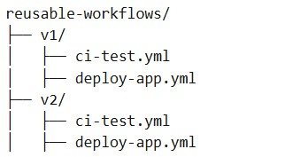

# org-reusable-workflows

## Repositorio de flujos de trabajo.

Contiene flujos de trabajo reutilizables para la automatización de CI/CD.

*Use directorios con versiones para mantener a largo plazo*

**Estructura**

